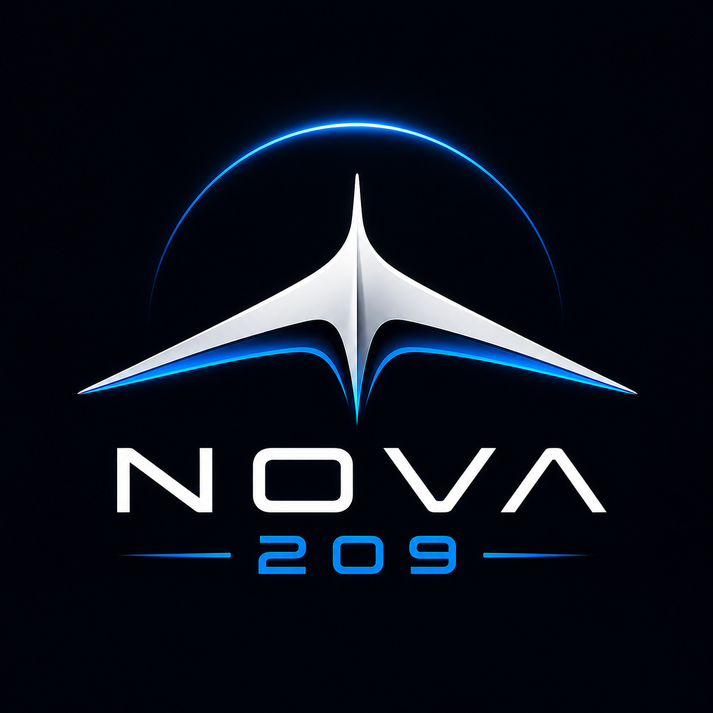
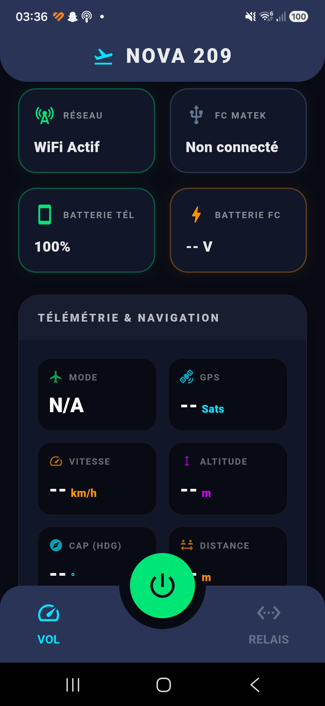
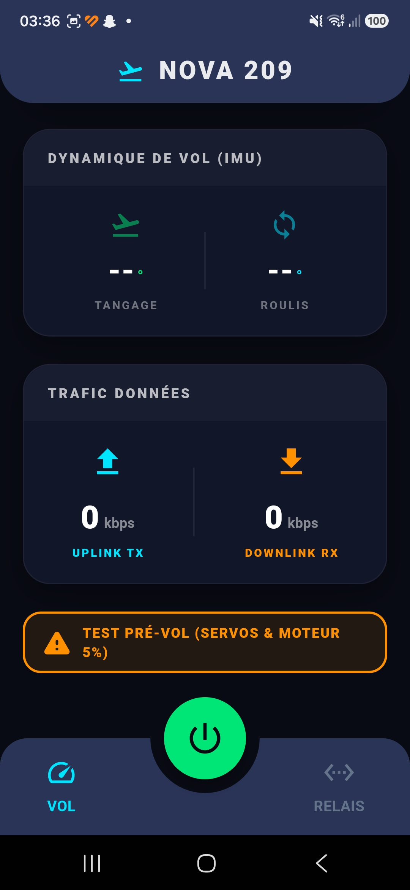
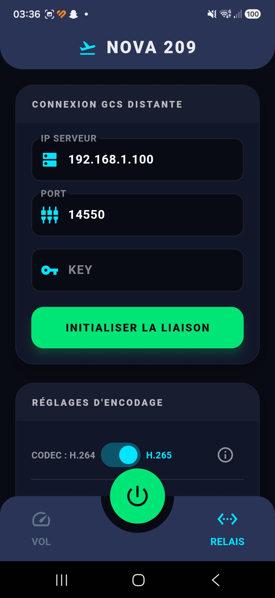
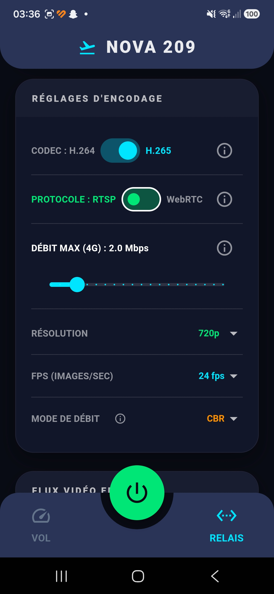
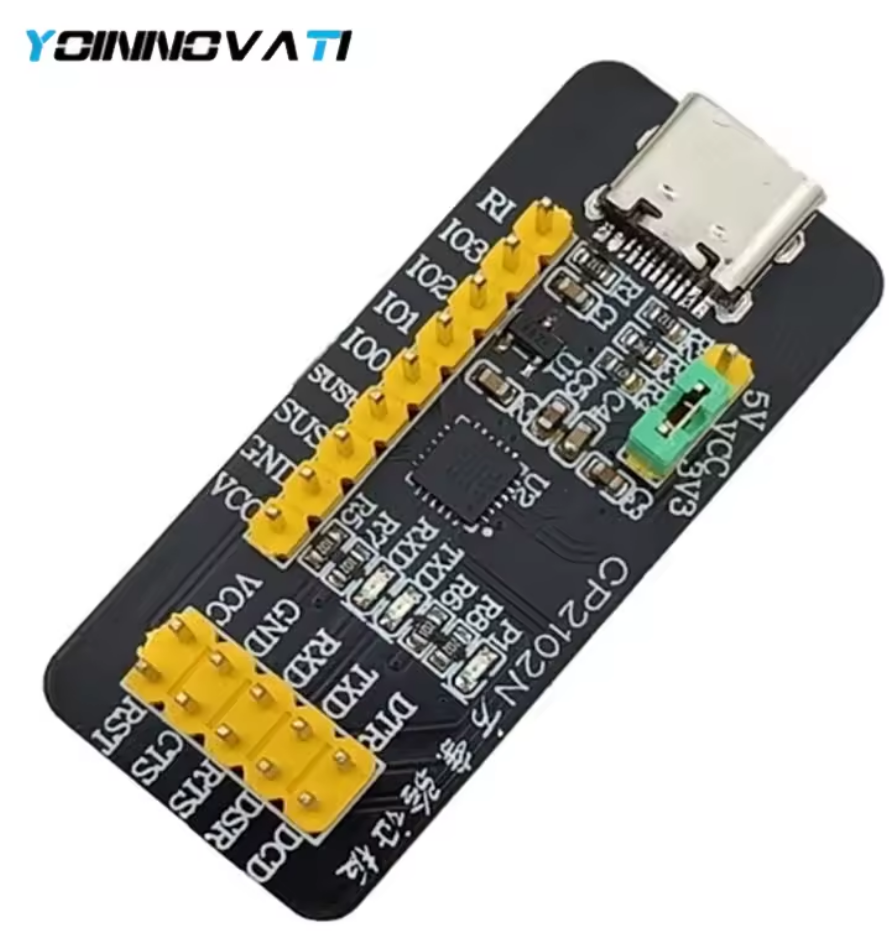

#  NOVA 209 - Application Relais de Télémétrie et Vidéo

**NOVA 209** est une application Android "Companion" de haute performance, spécialement conçue pour servir de relais de communication à bord d'une aile volante ou d'un drone (via un contrôleur de vol comme le **Matek F405-Wing**).

Le téléphone embarqué agit comme un pont 4G/5G bidirectionnel :
1. **Vidéo** : Capture le flux vidéo de la caméra du téléphone, l'encode en temps réel (H.264 / H.265) et le stream via RTSP/WebRTC vers votre station au sol (GCS).
2. **Télémétrie** : Récupère les données MAVLink du contrôleur de vol via USB OTG et les transmet à la station au sol via UDP/TCP, tout en les affichant sur le téléphone.

---

## 📸 Aperçu de l'Interface

L'interface de **NOVA 209** est conçue pour être lisible, moderne (Dark Mode, accents néon) et utilisable en plein soleil.

### Écran de Vol (Télémétrie)
Cet écran regroupe toutes les informations vitales du drone en temps réel.
<p align="center">
  
  
</p>

- **État Général** : Connexion réseau (WiFi/4G), État de la liaison MAVLink (FC Matek), Batterie du téléphone et Batterie du drone.
- **Navigation** : Mode de vol, satellites GPS, Vitesse (km/h), Altitude, Cap (Heading) et Distance.
- **Dynamique (IMU)** : Indicateurs de Tangage (Pitch) et Roulis (Roll).
- **Trafic** : Bande passante montante (Uplink) et descendante (Downlink).
- **Test Pré-vol** : Un utilitaire intégré pour vérifier rapidement les servos et les moteurs avant le décollage.

### Écran Relais (Configuration GCS et Vidéo)
Cet écran permet de paramétrer la liaison vers la station au sol (QGroundControl, Mission Planner...).
<p align="center">
  
  
</p>

- **Configuration GCS** : Saisie de l'IP du serveur distant, du port de communication et de la clé de chiffrement.
- **Réglages d'Encodage Vidéo** :
  - **Codec** : Choix entre H.264 (compatibilité) et H.265 (haute efficacité).
  - **Protocole** : RTSP ou WebRTC pour une latence minimale.
  - **Débit (Bitrate)** : Curseur ajustable (ex: 2.0 Mbps optimisé 4G).
  - **Résolution & FPS** : De 480p à 1080p, de 24 à 60 fps.
  - **Mode de débit** : CBR (Constant Bitrate) ou VBR (Variable).
- **Affichage Vidéo** : Bouton pour tester l'encodage et afficher un retour caméra local avant le vol.

---

## 🔋 Mode Éco (Bouton Central)
Le gros bouton vert au centre de la barre de navigation est le **Mode Éco**. 
Puisque le téléphone vole à bord de l'aile, l'écran allumé consomme de la batterie inutilement. Une simple pression sur ce bouton lance un compte à rebours et éteint totalement l'écran du téléphone tout en maintenant l'application active et le streaming vidéo/MAVLink en arrière-plan grâce au système `wakelock_plus`.
*Pour réveiller l'écran, il suffit de tapoter l'écran 4 fois rapidement.*

## 🛠️ Stack Technique et Fonctionnalités

- **Frontend** : Flutter (Dart) avec Material 3, animations fluides et UI 100% sur mesure (barres d'outils arrondies, faux-encoches, couleurs personnalisées).
- **Encodage Vidéo** : Kotlin & Android Camera2 API, utilisant la bibliothèque matérielle `rtmp-rtsp-stream-client-java` pour un streaming hardware H.265 avec zéro lag.
- **Réseau** : `connectivity_plus` pour monitorer la santé de la liaison 4G/5G.
- **Hardware USB** : `usb_serial` pour établir la liaison OTG-Série directe avec le contrôleur de vol Matek F405-Wing.
- **Gestion de l'énergie** : `battery_plus` et gestion poussée du cycle de vie de l'écran Android.
- **Autorisations** : Gestion dynamique et robuste des permissions système (Caméra, Microphone, etc.) via `permission_handler`.

## 🚀 Installation (Développement)

1. Clonez ce dépôt.
2. Assurez-vous d'avoir Flutter installé (version 3.x recommandée).
3. Connectez votre téléphone Android (avec le mode développeur et le débogage USB activé).
4. Exécutez la commande suivante pour compiler l'APK :
   ```bash
   make apk
   ```
   *L'APK généré se trouvera dans le dossier `exit/App_Wing.apk`.*
5. Transférez le fichier sur le téléphone et installez-le.

## ⚠️ Notes importantes pour le vol
- Veillez à bien accorder les permissions Caméra et Micro lors de la première installation. Sans cela, le flux vidéo sera bloqué par Android.
- Le flux MAVLink requiert que le câble USB OTG soit connecté **avant** d'initialiser la liaison, et le contrôleur de vol doit être configuré pour cracher la télémétrie sur le port USB (Mavlink 1 ou 2).

## 🔌 Câblage Matériel (Hardware)

Pour relier votre téléphone au contrôleur de vol et recevoir la télémétrie MAVLink, vous aurez besoin d'un adaptateur USB-Série comme le **CP2102N-A02-GQFN24R**.

<p align="center">
  
  
</p>

### Schéma de connexion :
1. **Branchez** le CP2102N sur le port USB de votre téléphone à l'aide d'un adaptateur USB OTG.
2. **Câblez** les broches du CP2102N vers un port UART libre du contrôleur de vol **Matek F405-WING V2** :
   - `TX` du CP2102N vers la broche `RX` d'un UART du Matek.
   - `RX` du CP2102N vers la broche `TX` de ce même UART.
   - `GND` vers `GND`.
   - *(Ne branchez pas le 5V si le Matek est déjà alimenté par sa batterie LiPo !)*
3. **Configurez** le port UART correspondant dans iNav / ArduPilot pour émettre de la télémétrie MAVLink.

---
*NOVA 209 - Développé pour repousser les limites des vols longue distance via réseau cellulaire.*
